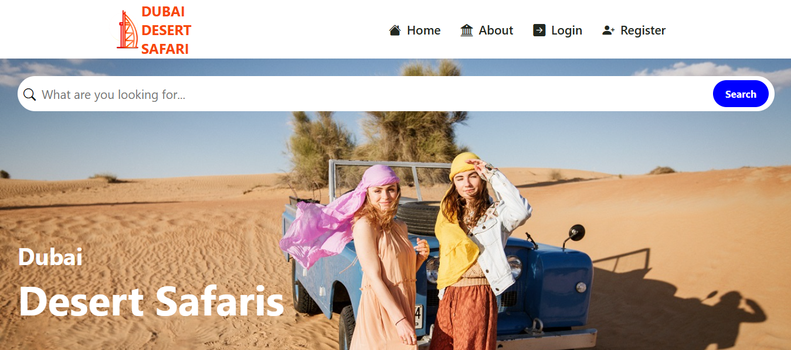
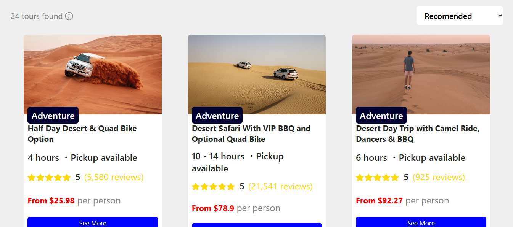
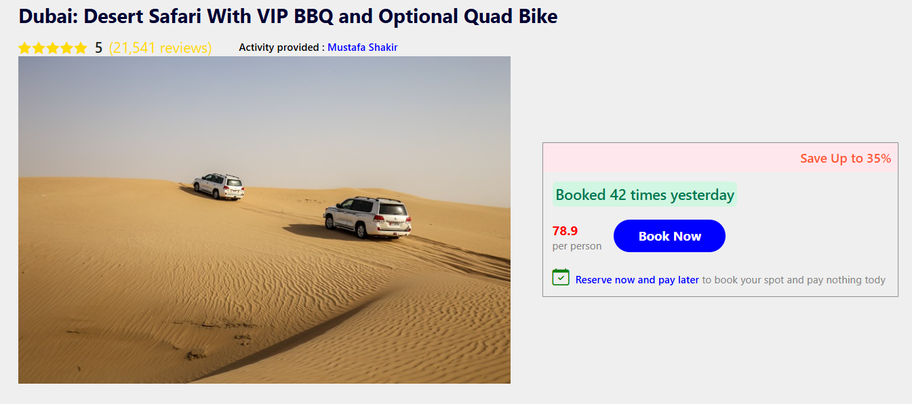
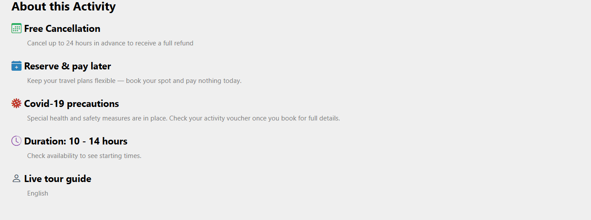
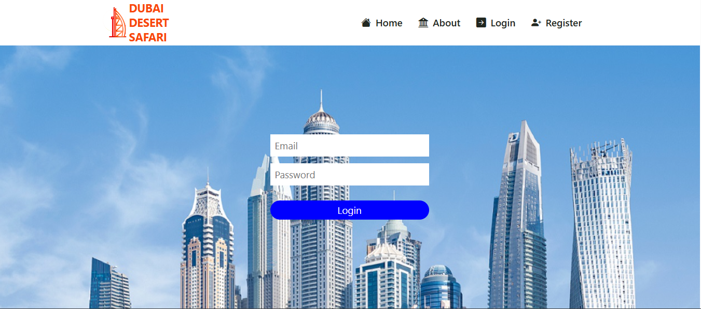
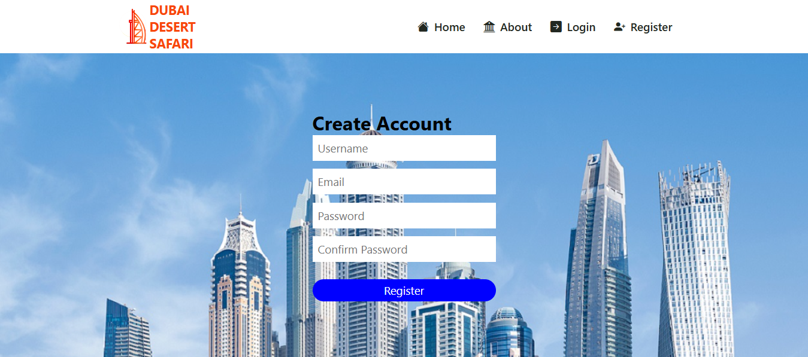

# 🐪 Dubai Desert Safari

A modern React.js web application that showcases desert safari tours in Dubai with a clean UI and smooth user experience.

---

## 🌍 Live Demo

🔗 https://mustafacoder365.github.io/Dubai-Desert-Safari/

---

## ✨ Features

- 🏜 Desert safari tours listing
- 📄 Dynamic single tour details page
- ⭐ Rating & reviews system
- 💳 Booking card with pricing
- 🔔 Toast notifications
- 🔐 Login & Register forms with validation
- 🌍 Multi-language & currency options (UI ready)
- 📱 Fully responsive design

---

## 🛠 Built With

- React.js
- React Router DOM
- Vite
- React Toastify
- Bootstrap Icons
- CSS3

---

## 📸 Screenshots

| Home | Tours |
|------|-------|
|  |  |

| Single Tour | Details |
|-------------|---------|
|  |  |

| Login | Register |
|-------|----------|
|  |  |

---

## 📂 Project Structure
Dubai-Desert-Safari/
│
├── screenshots/
├── public/
│ └── tours/
├── src/
│ ├── components/
│ ├── pages/
│ ├── data.js
│ ├── App.jsx
│ └── main.jsx
│
├── vite.config.js
└── README.md
---

## 🚀 Installation

```bash
git clone https://github.com/MustafaCoder365/Dubai-Desert-Safari.git
cd Dubai-Desert-Safari
npm install
npm run dev

## 👤 Author

**Mustafa Shakir**

- 🌐 GitHub: https://github.com/MustafaCoder365  
- 💼 LinkedIn: https://www.linkedin.com/in/mustafa-shakir-840374330  
- 📧 Email: mustafa1997670@gmail.com
